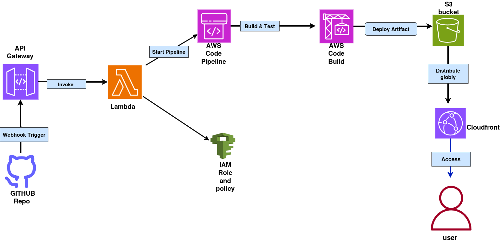

# 🚀 Serverless CI/CD Pipeline using AWS Lambda

A **fully serverless CI/CD pipeline** built on AWS that automatically deploys code from a **GitHub repository** to an **S3 static website**, all without EC2 or Jenkins.

This project demonstrates **event-driven DevOps automation** using AWS native services.

---
## 🛠️ **Architecture Workflow**



## 🧩 **Project Overview**

Whenever you push code to the GitHub repository:
1. **GitHub Webhook** triggers an **API Gateway endpoint**
2. **AWS Lambda** starts the **AWS CodePipeline**
3. **CodePipeline** uses **AWS CodeBuild** to build/test the application
4. Build artifacts are deployed to **Amazon S3**
5. **Amazon CloudFront** delivers the static site globally
6. **Amazon CloudWatch** monitors logs and events
7. **AWS IAM** manages access and permissions

---
## Tech stack
| Category       | Service                | Description                             |
| -------------- | ---------------------- | --------------------------------------- |
| Source Control | **GitHub**             | Stores source code & triggers webhook   |
| API Gateway    | **Amazon API Gateway** | Receives webhook event from GitHub      |
| Compute        | **AWS Lambda**         | Executes function to start CodePipeline |
| CI/CD          | **AWS CodePipeline**   | Orchestrates build & deployment         |
| Build          | **AWS CodeBuild**      | Compiles and tests code                 |
| Storage        | **Amazon S3**          | Hosts the static website                |
| Delivery       | **Amazon CloudFront**  | Delivers content globally               |
| Security       | **AWS IAM**            | Manages permissions and access          |

---
## 🧠 DevOps Concepts Demonstrated
- Serverless CI/CD automation

- Event-driven architecture

- GitHub webhook integration

- AWS-native CI/CD pipeline

- Infrastructure-as-Code mindset (manual setup, IaC optional)

- Cloud security & monitoring best practices
---
# 🚀 Setup Steps
## 1️⃣ Push Your Code to GitHub

- Create or use an existing repository with your app source code.

## 2️⃣ Create an API Gateway Endpoint

- Go to Amazon API Gateway → Create API

- Choose HTTP API

- Note the Invoke URL (this will be used in the GitHub webhook)

## 3️⃣ Create AWS Lambda Function

Runtime: Python 3.x / Node.js

Purpose: Trigger the pipeline

Sample Python code:
```
import boto3

def lambda_handler(event, context):
    client = boto3.client('codepipeline')
    response = client.start_pipeline_execution(name='your-pipeline-name')
    return {"status": "Pipeline started", "response": response}
```
- Add environment variable:

  - PIPELINE_NAME = your-pipeline-name

- Give Lambda permission to run CodePipeline:

  - Attach AWSCodePipelineFullAccess policy to its IAM Role.

---
# 4️⃣ Create CodePipeline

- Source: **GitHub (Connect via OAuth or token)**

- Build: **AWS CodeBuild**

- Deploy: **Amazon S3**

# 5️⃣ Add GitHub Webhook

- Go to your **GitHub Repo → Settings → Webhooks → Add webhook**

- Payload URL = your **API Gateway Invoke URL**

- Content type = application/json

- Trigger on Just the push event

# 6️⃣ Test the Flow

- Commit & push code to GitHub

- Watch the pipeline start automatically

- Deployed files will appear in your S3 bucket

- Access your static site via CloudFront URL

---
## 🔐 Security Notes

- Limit Lambda and CodePipeline IAM permissions (Principle of Least Privilege)

- Use HTTPS for API Gateway

- Rotate GitHub tokens if used

---
👨‍💻 Author

Ritesh — DevOps Enthusiast learning Cloud, Automation & Infrastructure as Code.


